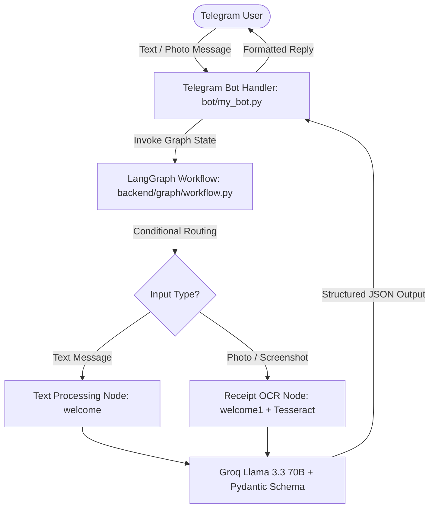

# SpendSnap

[](https://www.python.org/)
[](https://github.com/langchain-ai/langgraph)
[](https://groq.com/)
[](https://opensource.org/licenses/MIT)

An AI-powered Telegram bot that automatically extracts, categorizes, and logs personal expenses from natural language messages and receipt screenshots.

SpendSnap replaces manual expense logging with an instant chat interface. Users send transaction notes or photo receipts, and the bot parses key metadata into structured JSON records for personal financial tracking.

## Features

- **Natural Language Parsing:** Automatically identifies transaction amounts, dates, and items from conversational text.
- **Receipt OCR:** Extracts text from transaction screenshots and printed physical receipts using system OCR and Llama 3.3 70B.
- **Automated Categorization:** Classifies expenses into standardized categories (Food, Travel, Transportation, Utilities, Shopping, Entertainment, Healthcare, Education, Housing, Miscellaneous).
- **Multi-Currency Support:** Handles regional currency formats (USD, INR, EUR, etc.) and auto-formats monetary values.
- **Structured Schema Validation:** Enforces strict Pydantic JSON outputs for downstream database ingestion.

## Quick Start

### Prerequisites

- Python 3.10+
- [Tesseract OCR](https://github.com/tesseract-ocr/tesseract) installed on system PATH
- Groq Cloud API Key
- Telegram Bot Token from [@BotFather](https://t.me/botfather)

### Installation

```bash
git clone https://github.com/Kusagra9308/SpendSnap.git
cd SpendSnap

python -m venv venv
source venv/bin/activate  # On Windows: .\venv\Scripts\Activate.ps1

pip install -r requirements.txt
```

### Configuration

Create a `.env` file in the root directory:

```env
GROQ_API_KEY=your_groq_api_key
TELEGRAM_BOT_TOKEN=your_telegram_bot_token
# Optional: Only needed if Tesseract binary is not on system PATH
# TESSERACT_CMD=/usr/bin/tesseract   # Linux/macOS
# TESSERACT_CMD=C:\Program Files\Tesseract-OCR\tesseract.exe   # Windows
```

## Usage

### Running the Bot

```bash
python bot/my_bot.py
```

### Interacting via Telegram

Send commands or messages to your bot on Telegram:

- **`/start`** — View welcome message and instructions.
- **`/summary`** — Request expense summary report.
- **Text Entry:** Send any expense message (e.g., `"Paid 450 INR for groceries"`).
- **Photo Entry:** Send a photo of a receipt or payment screenshot with an optional caption.

#### Sample Interaction Response

```text
User: "Spent $35 on gas and $12 on lunch at Subway"

Bot Reply:
{
  "amount": 47.0,
  "category": "Transportation",
  "transaction_date": "2026-08-02"
}
```

### Programmatic Invocation

```python
from backend.graph.workflow import first_graph

# Invoke graph directly
result = first_graph.invoke({
    "input_type": "text",
    "text": "Paid $45 for gas today",
    "image_path": None
})

print(result["reply"][-1].content)
# Output: {"amount": 45.0, "category": "Transportation", "transaction_date": null}
```

## Architecture



## Current Limitations & Roadmap

- [ ] **Database Persistence:** Currently outputs extracted JSON records without writing to a database.
- [ ] **Dynamic Summary Queries:** `/summary` command is static pending database integration.
- [ ] **Groq Vision LLM:** Upgrade OCR pipeline from Tesseract to native multi-modal vision LLMs (`llama-3.2-11b-vision`).

## Contributing

Contributions, bug reports, and feature requests are welcome. Feel free to check the [issues page](https://github.com/Kusagra9308/SpendSnap/issues) or submit a pull request.

## License

Distributed under the [MIT License](LICENSE).
