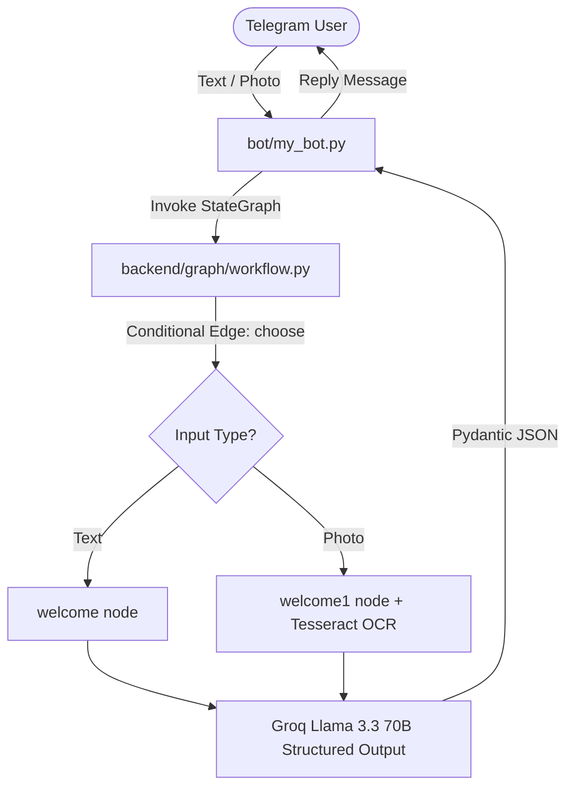

# SpendSnap

[](https://www.python.org/)
[](https://github.com/langchain-ai/langgraph)
[](https://groq.com/)
[](https://opensource.org/licenses/MIT)

Telegram bot that parses natural language messages and receipt screenshots into categorized expense entries.

## Features

- **Text Parsing:** Extracts amount, date, and category from text messages (e.g., *"Paid $14 for lunch"*).
- **Receipt OCR:** Extracts transaction metadata from receipt screenshots using Tesseract OCR and Llama 3.3 70B.
- **Structured Schema:** Enforces JSON output using Pydantic (`amount`, `category`, `transaction_date`).
- **Stateful Workflow:** Built with LangGraph conditional state routing (`START` -> `choose` -> `welcome`/`welcome1` -> `END`).

## Quick Start

### Prerequisites

- Python 3.10+
- [Tesseract OCR](https://github.com/tesseract-ocr/tesseract) installed on system PATH
- Groq Cloud API Key
- Telegram Bot Token from [@BotFather](https://t.me/botfather)

### Installation

```bash
git clone https://github.com/Kusagra9308/SpendSnap.git
cd SpendSnap

python -m venv venv
source venv/bin/activate  # On Windows: .\venv\Scripts\Activate.ps1

pip install -r requirements.txt
```

### Configuration

Create a `.env` file in the root directory:

```env
GROQ_API_KEY=your_groq_api_key
TELEGRAM_BOT_TOKEN=your_telegram_bot_token
# Optional if Tesseract is not on system PATH:
# TESSERACT_CMD=C:\Program Files\Tesseract-OCR\tesseract.exe
```

## Usage

### Running the Bot

```bash
python bot/my_bot.py
```

### Interacting via Telegram

Send commands or messages to your bot on Telegram:

- `/start` — View introduction and instructions.
- `/summary` — Request expense summary report.
- **Text:** Send any expense message like `"Spent 250 INR on dinner"`.
- **Photo:** Upload a receipt screenshot with optional caption.

### Programmatic Invocation

```python
from backend.graph.workflow import first_graph

# Invoke graph directly
result = first_graph.invoke({
    "input_type": "text",
    "text": "Paid $45 for gas today",
    "image_path": None
})

print(result["reply"][-1].content)
# Output: {"amount": 45.0, "category": "Transportation", "transaction_date": null}
```

## Architecture



## Current Limitations & Roadmap

- [ ] **Database Persistence:** Currently returns extracted data without storing it in a database.
- [ ] **Dynamic Summary:** `/summary` currently returns a static message pending database integration.
- [ ] **Groq Vision LLM:** Upgrade OCR pipeline to use multi-modal vision models directly instead of Tesseract.

## Contributing

1. Fork the repository
2. Create your feature branch (`git checkout -b feature/my-feature`)
3. Commit your changes (`git commit -m "add my feature"`)
4. Push to the branch (`git push origin feature/my-feature`)
5. Open a Pull Request

## License

Distributed under the [MIT License](LICENSE).
